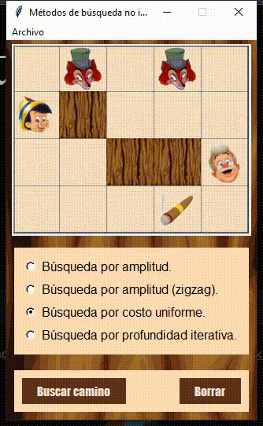

# First Project - Artificial Intelligence
First project of the Artificial Intelligence course, University of Valle.

Program in Python where Pinocchio looks for and finds Gepetto inside a maze with different obstacles. For this, the breadth search, uniform cost search and iterative depth search techniques are implemented.

 

